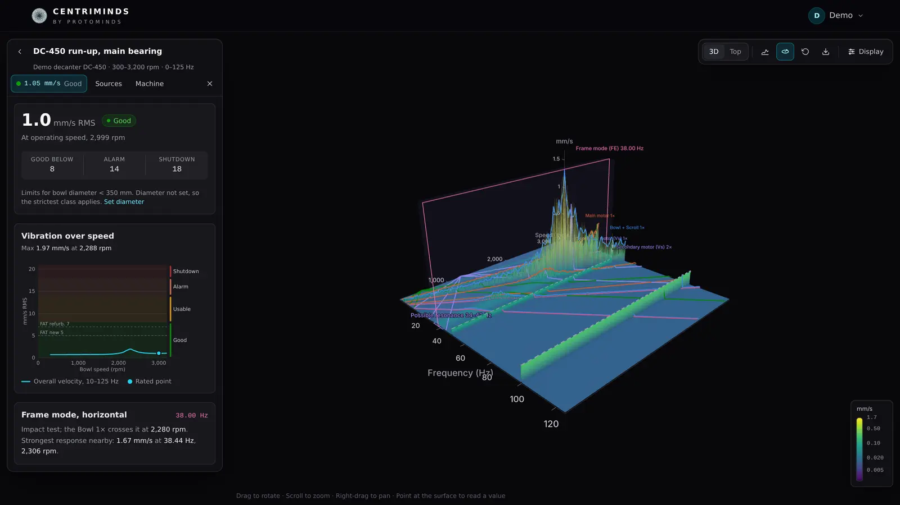
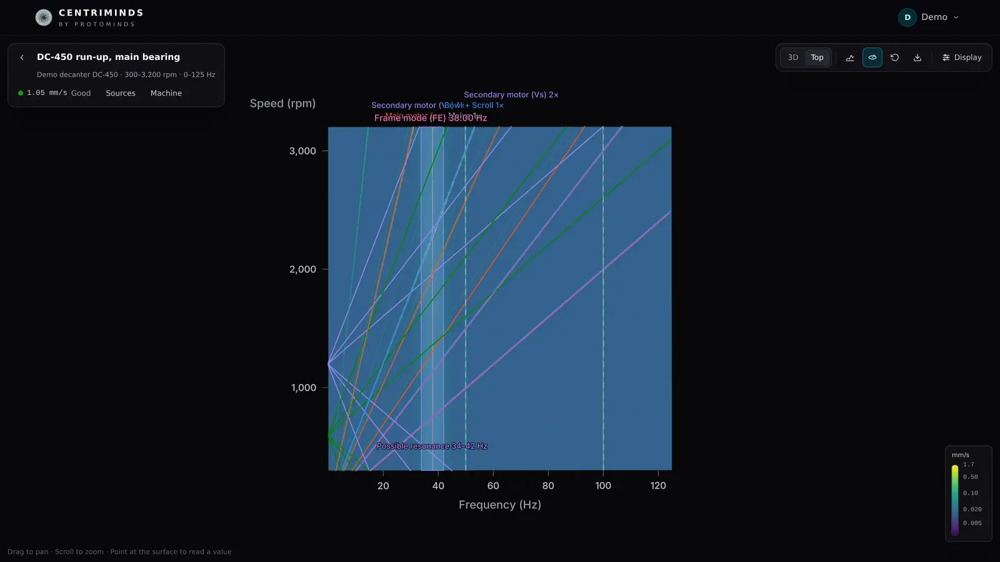
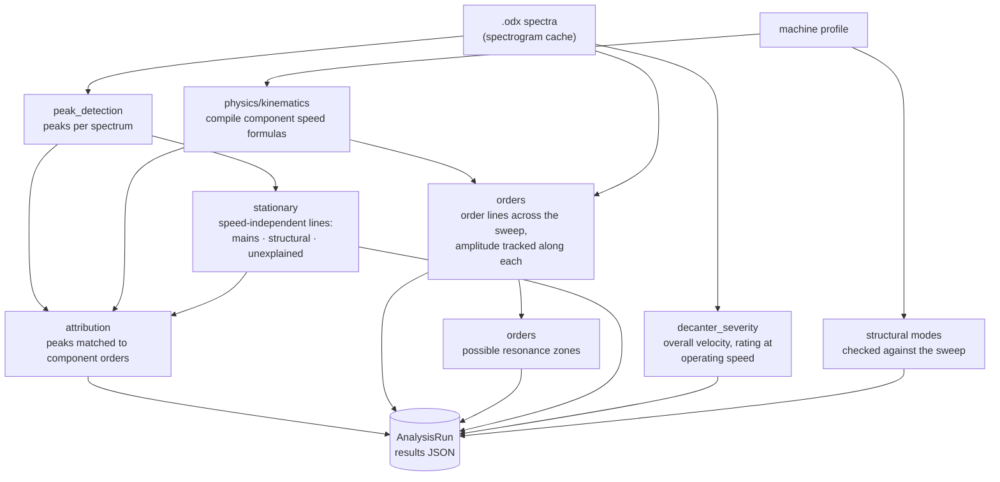

# CentriMinds

[](https://github.com/protominds-io/centriminds/actions/workflows/ci.yml)
[](LICENSE)
[](.github/dependabot.yml)
[](CODE_OF_CONDUCT.md)


**Vibration analysis for decanter centrifuges, in 3D.** Upload a VIBXPERT /
Omnitrend `.odx` speed sweep and CentriMinds draws it as an interactive
waterfall with the machine's order lines on it. It suggests resonance zones,
tells mains-related lines from the machine's own, and rates the machine
against the permissible vibration levels for decanters. Everything it knows
about a machine is data: a *machine profile* that experts import, check
against their commissioning sheets and edit.

A product by [Protominds](https://www.protominds.io/). Version 0.1.



<sub>Screenshots show a synthetic sweep with made-up numbers; customer
measurements never leave their owners' instances.</sub>

- [Why it matters](#why-it-matters)
- [Features](#features)
- [Engineering quality](#engineering-quality)
- [Architecture](#architecture)
- [Quick start](#quick-start)
- [Tech stack](#tech-stack)
- [Documentation](#documentation) · [License](#license)

## Why it matters

- **The whole sweep at a glance.** A run-up is hundreds of spectra. Instead
  of reading them one by one to find where an order line crosses a natural
  frequency, CentriMinds shows the sweep as one surface and names the
  crossings ("Bowl 1× crosses it at 2,280 rpm").
- **The machine's knowledge stays with the machine.** Gear ratios, pulleys,
  belt lengths and known modes live in a profile, not in an engineer's head
  or a spreadsheet. Every later measurement of that machine reuses it, and
  uploads pick their profile automatically.
- **A rating that fits decanters.** ISO 10816-3 zones do not apply to
  decanters, so the condition rating uses the permissible levels for the
  bowl-diameter class instead, at operating speed.
- **Self-hosted, private by design.** One Docker Compose stack; measurement
  files stay on the operator's own disk, and the browser makes no
  third-party requests.

## Features

| | |
| --- | --- |
| **Condition rating** | Overall RMS velocity (10–1000 Hz, Parseval sum of the spectrum lines) for every spectrum, rated at operating speed (≥ 90 % of the sweep's top speed) against the ANDRITZ permissible-level set points for the bowl-diameter class: good, usable, alarm, shutdown. ISO 10816-3 zones do not apply to decanters. The *vibration over speed* chart shows the whole sweep against the zones and the FAT reference levels. |
| **3D waterfall** | Frequency × speed × amplitude, linear or log scale, perspective or top (spectrogram) view, full screen. Point at the surface to read a value; the hovered speed's spectrum opens as a 2D slice; frequency and speed windows zoom in. Overlays: order lines, resonance zones, speed-independent lines, structural modes, source peaks, alarm/shutdown planes and annotations. *Save image* downloads the annotated view. |
| **Colour schemes** | Viridis, Magma, Ocean, Teal and Graphite, each in a dark and a light version. On the linear scale the colour can follow a logarithmic spread (60 or 80 dB) while heights stay true, with a colour legend. |
| **Machine profiles** | A machine's drive train as parameters (gear ratios, pulleys, belt lengths, differential speed, mains frequency) and components whose speeds are formulas of the bowl speed, plus operating points, structural modes, known resonance zones and the text that identifies the machine in an export's path. Imported from a machine speeds workbook (`.xlsx`) or a profile file (`.json`), started from a template, edited with live formula checks. Uploads pick their profile automatically. Format: [docs/machine-profiles.md](docs/machine-profiles.md). |
| **Order analysis** | Every component order drawn across the sweep, lines the resolution cannot separate merged, the amplitude tracked along each; *possible resonance zones* where several lines swell at one frequency, ranked; speed-independent lines classified as mains, a known structural mode or unexplained; peaks matched to component orders. |
| **Annotations** | Frequency and speed lines, frequency zones, notes pinned to a point on the surface and order lines, saved with the project; a suggested zone is kept with one click. |
| **Accounts** | Email/password sign-in; projects are private to their owner. Per-account settings: theme (dark, light, device), language, 3D view defaults, name, password. A password change or *Sign out everywhere* ends the other sessions. |
| **English and German** | The whole interface, including numbers, dates and units (decimal comma, U/min). |



## Engineering quality

Built as a production system, not a prototype. Every claim below points at
the code that backs it.

| | |
| --- | --- |
| **Automated checks on every push and PR** | Backend: ruff (lint and format) and pytest. Frontend: TypeScript, ESLint, knip (no unused code or dependencies), Prettier, Vitest, production build. Infrastructure: cfn-lint, shellcheck. Docker images built and smoke-tested through nginx. ([ci.yml](.github/workflows/ci.yml)) |
| **One command, same as CI** | `make check` runs the same checks in Docker, so a contributor needs nothing but Docker. ([Makefile](Makefile)) |
| **Tests without customer data** | The tests generate synthetic `.odx` files and workbooks; checks against real commissioning data run separately with the data mounted read-only (`make check-reference`). ([conftest.py](backend/tests/conftest.py)) |
| **Schema under control** | Alembic migrations applied at startup; a test fails if the models and the migrated schema ever drift apart. ([test_migrations.py](backend/tests/test_migrations.py)) |
| **Secret scanning** | gitleaks scans the whole history in CI, and fails loudly if it could not read all of it instead of reporting "no leaks". ([Makefile](Makefile), [.gitleaks.toml](.gitleaks.toml)) |
| **Supply chain** | GitHub Actions pinned to commit SHAs, the gitleaks image pinned by digest, lockfiles for npm and uv, CI with read-only permissions, weekly Dependabot updates. ([ci.yml](.github/workflows/ci.yml), [dependabot.yml](.github/dependabot.yml)) |
| **Typed end to end** | Pydantic schemas are the API contract, mirrored by TypeScript types; SQLAlchemy's typed ORM; German translations typed against the English source. |
| **Operable** | Verified weekly backups to S3 with Object Lock, a backup before every deploy, an alarm when backups go stale, infrastructure as one CloudFormation stack. ([docs/self-hosting.md](docs/self-hosting.md)) |

### Security

To report a vulnerability, see [SECURITY.md](SECURITY.md), which also has
advice for running your own instance.

- Passwords hashed with bcrypt; JWT sessions, which a password change ends on
  every other device; projects scoped to their owner.
- Sign-in and sign-up are rate limited per client IP. nginx decides that IP:
  it overwrites `X-Forwarded-For` and trusts only proxies it is told about
  (`deploy/aws/real-ip.conf` for Caddy).
- Content-Security-Policy, `nosniff`, referrer and permissions policies on
  every response (`frontend/security-headers.conf`); HSTS from Caddy.
- Containers run as non-root users and the backend's code is read-only to
  its user; the AWS instance is managed through SSM only (no SSH), with
  IMDSv2 and hop limit 1, so containers cannot reach instance credentials.
- No third-party requests from the browser (the 3D labels' font is
  self-hosted).
- CI scans every commit for committed secrets (gitleaks, `.gitleaks.toml`).

## Architecture

Two containers and a data volume. The frontend container's nginx serves the
single-page app and proxies `/api` to the backend; the backend is a FastAPI
app that keeps everything in one SQLite database plus the uploaded files. In
production Caddy sits in front for TLS.


### The analysis pipeline

`analysis/pipeline.py` runs one sweep against one machine profile, in about
0.1–0.2 s for a typical sweep (234 spectra × 3200 lines):



More diagrams (request flow, data model, frontend structure) are in
[docs/architecture.md](docs/architecture.md).

## Quick start

Everything runs in Docker (Compose v2); the host needs nothing else.

```bash
make up        # build and start → http://localhost:3000
make dev       # hot-reloading UI on http://localhost:5173 (uses the stack's API)
make check     # what CI runs: ruff, pytest, tsc, ESLint, knip, Prettier, Vitest, build
make format    # apply ruff and Prettier
make down      # stop (data stays in the centriminds_data volume)
make           # list every target
```

Register an account on the sign-in page, import your machine profiles
(*Machines*), upload an `.odx` file, and the analysis runs when the project
opens. Measurement files and machine data are customer data and never part
of the repository: the tests generate synthetic ones, and
`make check-reference REFERENCE_DIR=…` checks the analysis against real data
kept elsewhere. The development workflow is in
[CONTRIBUTING.md](CONTRIBUTING.md).

Contributions are welcome: see [CONTRIBUTING.md](CONTRIBUTING.md) and the
[Code of Conduct](CODE_OF_CONDUCT.md). Issues and pull requests use the
templates in `.github/`.

## Tech stack

| Layer | |
| --- | --- |
| Frontend | React 19, React Router 8, TanStack Query 5, zustand 5, three.js r186 with react-three-fiber 9 / drei 10, Tailwind CSS 4, Vite 8, TypeScript 6 |
| Backend | Python 3.14, FastAPI 0.142, Pydantic 2, SQLAlchemy 2.1 (typed ORM), Alembic, NumPy 2.5, SciPy 1.18 |
| Storage | SQLite (WAL, foreign keys enforced) + uploaded `.odx` files on a Docker volume |
| Serving | nginx 1.30 (unprivileged) → uvicorn; Caddy 2.11 for TLS on AWS |
| Quality | Vitest + Testing Library, pytest, ESLint 10, ruff, Prettier, knip, cfn-lint, shellcheck, gitleaks, GitHub Actions, Dependabot |

TypeScript stays on 6.0 until `typescript-eslint` supports the TypeScript 7
native compiler.

## Documentation

- [CONTRIBUTING.md](CONTRIBUTING.md): development workflow, project layout,
  conventions, checks.
- [docs/architecture.md](docs/architecture.md): request flow, data model,
  frontend structure.
- [docs/machine-profiles.md](docs/machine-profiles.md): the machine profile
  format.
- [docs/self-hosting.md](docs/self-hosting.md): configuration, AWS
  deployment, backups and restore.
- [SECURITY.md](SECURITY.md): reporting a vulnerability, running your own
  instance safely.

Contributions are welcome: see [CONTRIBUTING.md](CONTRIBUTING.md) and the
[Code of Conduct](CODE_OF_CONDUCT.md). Issues and pull requests use the
templates in `.github/`.

## License

[MIT](LICENSE) © 2026 Protominds – Maximilian Hummel und Abdullah Shams GbR.
