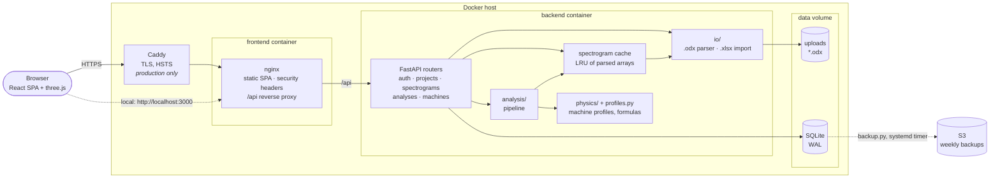
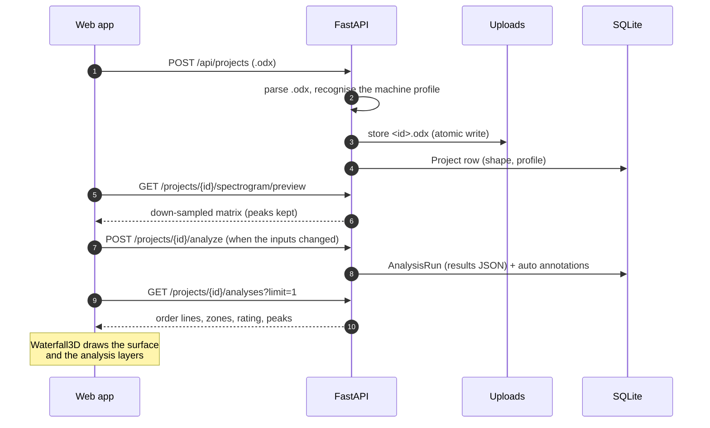
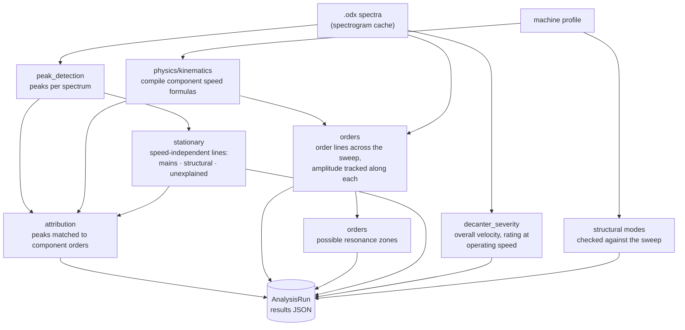
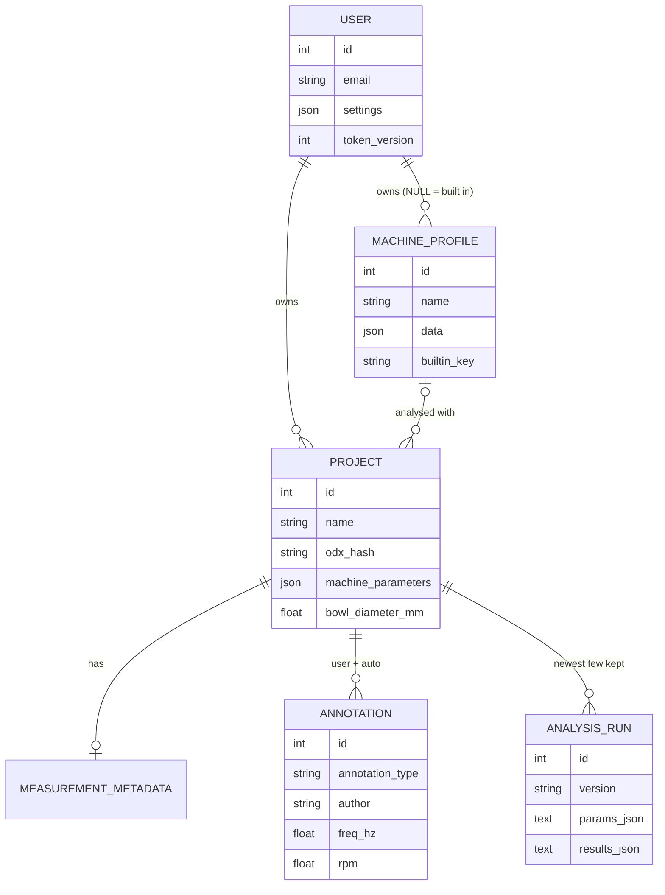
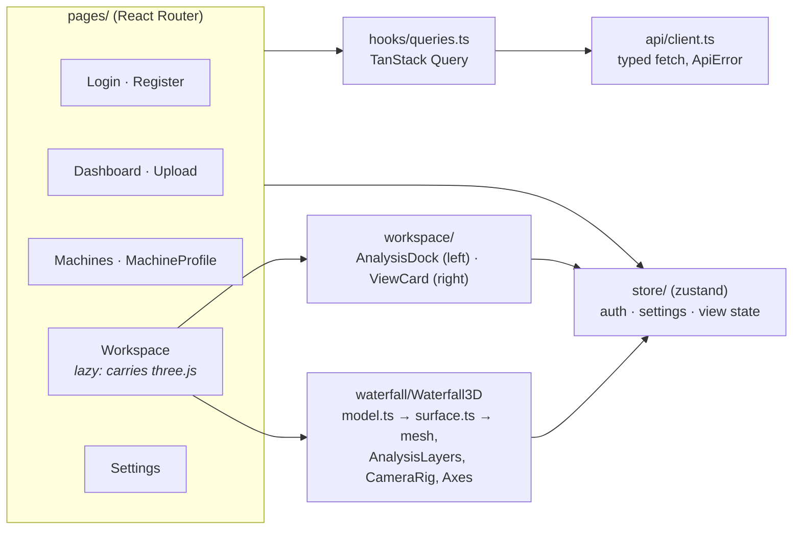
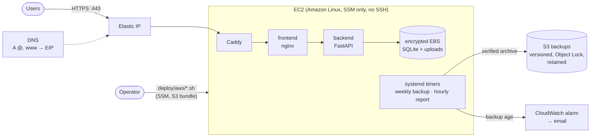

# CentriMinds

[](https://github.com/protominds-io/centriminds/actions/workflows/ci.yml)
[](LICENSE)
[](.github/dependabot.yml)
[](CODE_OF_CONDUCT.md)

**Vibration analysis for decanter centrifuges, in 3D.** Upload a VIBXPERT /
Omnitrend `.odx` speed sweep and CentriMinds draws it as an interactive
waterfall with the machine's order lines on it. It suggests resonance zones,
tells mains-related lines from the machine's own, and rates the machine
against the permissible vibration levels for decanters. Everything it knows
about a machine is data: a *machine profile* that experts import, check
against their commissioning sheets and edit.

A product by [Protominds](https://www.protominds.io/). Version 0.1.

- [Features](#features)
- [Quick start](#quick-start)
- [Architecture](#architecture)
- [Project layout](#project-layout)
- [Conventions](#conventions)
- [Configuration](#configuration)
- [Security](#security)
- [Self-hosting on AWS](#self-hosting-on-aws)
- [CI](#ci) · [License](#license)

## Features

| | |
| --- | --- |
| **Condition rating** | Overall RMS velocity (10–1000 Hz, Parseval sum of the spectrum lines) for every spectrum, rated at operating speed (≥ 90 % of the sweep's top speed) against the ANDRITZ permissible-level set points for the bowl-diameter class: good, usable, alarm, shutdown. ISO 10816-3 zones do not apply to decanters. The *vibration over speed* chart shows the whole sweep against the zones and the FAT reference levels. |
| **3D waterfall** | Frequency × speed × amplitude, linear or log scale, perspective or top (spectrogram) view, full screen. Point at the surface to read a value; the hovered speed's spectrum opens as a 2D slice; frequency and speed windows zoom in. Overlays: order lines, resonance zones, speed-independent lines, structural modes, source peaks, alarm/shutdown planes and annotations. *Save image* downloads the annotated view. |
| **Colour schemes** | Viridis, Magma, Ocean, Teal and Graphite, each in a dark and a light version. On the linear scale the colour can follow a logarithmic spread (60 or 80 dB) while heights stay true, with a colour legend. |
| **Machine profiles** | A machine's drive train as parameters (gear ratios, pulleys, belt lengths, differential speed, mains frequency) and components whose speeds are formulas of the bowl speed, plus operating points, structural modes, known resonance zones and the text that identifies the machine in an export's path. Imported from a machine speeds workbook (`.xlsx`) or a profile file (`.json`), started from a template, edited with live formula checks. Uploads pick their profile automatically. Format: [docs/machine-profiles.md](docs/machine-profiles.md). |
| **Order analysis** | Every component order drawn across the sweep, lines the resolution cannot separate merged, the amplitude tracked along each; *possible resonance zones* where several lines swell at one frequency, ranked; speed-independent lines classified as mains, a known structural mode or unexplained; peaks matched to component orders. |
| **Annotations** | Frequency and speed lines, frequency zones, notes pinned to a point on the surface and order lines, saved with the project; a suggested zone is kept with one click. |
| **Accounts** | Email/password sign-in; projects are private to their owner. Per-account settings: theme (dark, light, device), language, 3D view defaults, name, password. A password change or *Sign out everywhere* ends the other sessions. |
| **English and German** | The whole interface, including numbers, dates and units (decimal comma, U/min). |

## Quick start

Everything runs in Docker (Compose v2); the host needs nothing else.

```bash
make up        # build and start → http://localhost:3000
make dev       # hot-reloading UI on http://localhost:5173 (uses the stack's API)
make check     # what CI runs: ruff, pytest, tsc, ESLint, knip, Prettier, Vitest, build
make format    # apply ruff and Prettier
make down      # stop (data stays in the centriminds_data volume)
make           # list every target
```

Register an account on the sign-in page, import your machine profiles
(*Machines*), upload an `.odx` file, and the analysis runs when the project
opens. Measurement files and machine data are customer data and never part
of the repository: the tests generate synthetic ones, and
`make check-reference REFERENCE_DIR=…` checks the analysis against real data
kept elsewhere. The development workflow is in
[CONTRIBUTING.md](CONTRIBUTING.md).

## Architecture

Two containers and a data volume. The frontend container's nginx serves the
single-page app and proxies `/api` to the backend; the backend is a FastAPI
app that keeps everything in one SQLite database plus the uploaded files. In
production Caddy sits in front for TLS.



### How a measurement flows through it



The workspace asks for an analysis whenever the run's input fingerprint
(profile, per-project parameters, pipeline version) differs from the latest
run's, so a profile edit shows up the next time the project opens.

### The analysis pipeline

`analysis/pipeline.py` runs one sweep against one machine profile, in about
0.1–0.2 s for a typical sweep (234 spectra × 3200 lines):



### Data model



The schema belongs to the Alembic migrations in `backend/alembic/versions/`,
applied when the API starts; a test checks that it matches the SQLAlchemy
models.

### In the browser



`WaterfallModel` (`components/waterfall/model.ts`) is the one place that maps
frequency, speed and amplitude to scene coordinates; the surface, the
overlays, picking and the slice view all go through it.

## Project layout

```
backend/app/
  main.py              app factory, routers, health check
  config.py            settings from the environment (pydantic-settings)
  db.py                engine (SQLite pragmas), sessions, startup migrations
  models.py            database tables (SQLAlchemy typed ORM)
  schemas.py           API request/response shapes (Pydantic): the public contract
  auth.py, ratelimit.py  sign-in, JWT sessions, per-IP limits on auth endpoints
  errors.py            AppError: HTTP errors with a code the UI translates
  routers/             one module per resource; thin HTTP layer
  analysis/            the pipeline above, one module per stage
  physics/             machine profile format, formula language, speeds, templates
  profiles.py          profiles in the database: built-ins, recognition
  io/                  .odx parser, machine speeds workbook import
  backup.py            `python -m app.backup create|verify|restore`
backend/alembic/versions/   schema migrations (applied at startup)
backend/tests/              pytest; synthetic .odx files and workbooks

frontend/src/
  api/                 typed fetch client + DTO types (mirror schemas.py)
  i18n/                useI18n (t, fmt); en/ is the source, de/ is typed against it
  hooks/               React Query hooks, presence (exit animations), …
  lib/                 theme, colour schemes, severity zones, ticks, motion
  store/               zustand stores (auth, settings, workspace view state)
  components/ui/       shared primitives: icons, controls, Panel, Reveal, …
  components/waterfall/  the 3D view: model, surface, scene parts, overlays,
                       camera, axes, display settings, slice, legend
  components/workspace/  the floating cards around the 3D view
  components/machines/ the machine profile editor
  components/          app components (ConditionPanel, MachineInfoCard, …)
  pages/               routes

deploy/aws/            provision, deploy, backup, restore, teardown scripts
deploy/hostinger/      optional DNS helper
infra/aws/template.yml CloudFormation stack (EC2, S3 backups, alarms)
docs/                  machine profile format
```

## Conventions

These keep changes safe; [CONTRIBUTING.md](CONTRIBUTING.md) has the rest.

- **API changes**: add fields to `schemas.py` and `api/types.ts`; keep old
  fields until the frontend no longer reads them. New tables or columns get
  a new Alembic migration.
- **UI**: build from `components/ui/` (Panel, controls, icons, CommitInput)
  instead of one-off styling.
- **Colours**: only the tokens in `src/index.css`, defined by role and
  flipped with the theme (`<html data-theme>`): `ink-*` neutrals (50 =
  strongest text … 950 = page), `accent-*`, `edge/NN` for hairlines and
  overlays (never `white/…`), `zone-*`, `primary`. No hex in components; the
  WebGL scene picks its palette with `useResolvedTheme()`. Colours handed to
  WebGL as numbers (vertex and instance colours) must be linear light
  (`colormap(…, 'linear')` or `setRGB(…, SRGBColorSpace)`), or they render
  paler than CSS draws them.
- **Text**: no user-visible string in components. Add a key to
  `src/i18n/en/<area>.ts` and its translation to `src/i18n/de/<area>.ts`,
  then `t('area.key')`; numbers, units and dates go through `fmt`. German
  uses the formal "Sie".
- **Errors**: the backend raises `AppError(status, code, message, params)`;
  give each new code a message in `src/i18n/*/errors.ts`.
- **3D view**: position everything through `WaterfallModel`; never map
  coordinates by hand.
- **Tests**: backend in `backend/tests/` (pytest), frontend next to the code
  as `*.test.ts(x)` (Vitest). `make check` stays green.

## Configuration

Backend environment variables (`backend/app/config.py`):

| Variable | Default | |
| --- | --- | --- |
| `APP_ENV` | `development` | `production` refuses a weak `JWT_SECRET` and disables the API docs. |
| `JWT_SECRET` | dev placeholder | ≥ 32 random characters in production (`openssl rand -hex 32`). |
| `JWT_ALGORITHM` | `HS256` | `HS256`, `HS384` or `HS512`. |
| `JWT_EXPIRE_DAYS` | `7` | Session length (1–90). |
| `ALLOW_REGISTRATION` | `true` | `false` closes sign-up (the default on AWS). |
| `REGISTRATION_EMAILS` | empty | Comma-separated addresses that may sign up; empty lets anyone. Production needs it whenever sign-up is open. |
| `CORS_ORIGINS` | localhost | Comma-separated. |
| `DATA_DIR` | `./data` | SQLite database and uploads (`/data` in Docker). |
| `MAX_UPLOAD_MB` | `100` | Upload size cap (also enforced by nginx and Caddy). |
| `AUTH_ATTEMPTS_PER_MINUTE` | `10` | Sign-in/sign-up attempts per client IP. |

## Security

To report a vulnerability, see [SECURITY.md](SECURITY.md), which also has
advice for running your own instance.

- Passwords hashed with bcrypt; JWT sessions, which a password change ends on
  every other device; projects scoped to their owner.
- Sign-in and sign-up are rate limited per client IP. nginx decides that IP:
  it overwrites `X-Forwarded-For` and trusts only proxies it is told about
  (`deploy/aws/real-ip.conf` for Caddy).
- Content-Security-Policy, `nosniff`, referrer and permissions policies on
  every response (`frontend/security-headers.conf`); HSTS from Caddy.
- Containers run as non-root users and the backend's code is read-only to
  its user; the AWS instance is managed through SSM only (no SSH), with
  IMDSv2 and hop limit 1, so containers cannot reach instance credentials.
- No third-party requests from the browser (the 3D labels' font is
  self-hosted).
- CI scans every commit for committed secrets (gitleaks, `.gitleaks.toml`).

## Self-hosting on AWS

One EC2 instance runs the Compose stack (`deploy/aws/docker-compose.yml`);
Caddy terminates TLS with Let's Encrypt. The infrastructure is one
CloudFormation stack (`infra/aws/template.yml`).



Prerequisites: AWS CLI v2 with credentials, `python3`, `git` and `curl`.
The scripts read their settings from the environment (all listed at the top
of `deploy/aws/env.sh`):

| Variable | Default | |
| --- | --- | --- |
| `DOMAIN` | `centriminds.de` | Apex domain the app is served on; `www.` redirects to it. **Set your own.** |
| `AWS_PROFILE` | `centriminds` | AWS CLI profile; empty (`AWS_PROFILE=`) uses the CLI's default credentials. |
| `AWS_REGION` | `eu-central-1` | Region of the stack. |
| `STACK` | `centriminds` | Stack name, also the prefix of its bucket names. |
| `ALERT_EMAIL` | keeps current | Address for backup alarms (`provision.sh`). |
| `INSTANCE_TYPE` | `t3.small` | EC2 size (`provision.sh`; a change is a stop/start, data kept). |
| `BACKUP_RETENTION_DAYS` | `90` | How long weekly backups are kept (`provision.sh`). |
| `REFRESH_AMI` | `0` | `1` moves to the newest Amazon Linux, which replaces the instance (`provision.sh`). |
| `REGISTRATION_EMAILS` | keeps current | Who may sign up, or `none` (`deploy.sh`). |
| `SKIP_PREDEPLOY_BACKUP`, `SKIP_BACKUP` | `0` | Skip the safety backup before a deploy, or before a replacement or teardown. |

```bash
export DOMAIN=example.com AWS_PROFILE=myprofile
ALERT_EMAIL=ops@example.com ./deploy/aws/provision.sh   # 1. stack → prints the Elastic IP
# 2. point the A records of @ and www at that IP at your DNS provider
#    (for Hostinger: HOSTINGER_API_TOKEN=… ./deploy/hostinger/set-dns.sh "$DOMAIN" <EIP>)
./deploy/aws/deploy.sh                                   # 3. build + start; re-run to redeploy
```

`provision.sh` applies every change through a CloudFormation change set and
shows it first. Settings you do not pass keep their values. A change that
would replace the instance, and with it the disk holding the data, stops for
confirmation, takes a backup first and prints the commands that bring the
data back. Grow the 30 GB volume in place (`aws ec2 modify-volume`, then
`growpart` and `xfs_growfs`) rather than in the template.

Sign-up is closed after the first deploy. To let people create accounts,
deploy with the addresses that may sign up; each person then registers with
a password of their own. Close it again with `none`. The app refuses to
start in production with sign-up open to anyone.

```bash
REGISTRATION_EMAILS=you@example.com,colleague@example.com ./deploy/aws/deploy.sh
REGISTRATION_EMAILS=none ./deploy/aws/deploy.sh
```

Other hosts work too: any machine with Docker can run
`deploy/aws/docker-compose.yml` (or the root `docker-compose.yml` behind a
TLS proxy of your own; tell nginx about that proxy as `real-ip.conf` does).

### Backups (data only)

The application is rebuilt from Git; only the data is backed up: the SQLite
database and the uploaded `.odx` files.

- **Weekly**: every Sunday 02:30 UTC a systemd timer takes a consistent
  snapshot (SQLite online backup while the app keeps running), verifies
  every checksum in the archive and uploads it to
  `s3://<stack>-backups-<account>/weekly/`. It runs in a one-off container
  on the data volume, so it also works while the app is down.
- **Before every deploy**: the same backup goes to `pre-deploy/` (kept 30
  days), so a bad migration can be rolled back. The deploy stops if the
  backup fails.
- **Storage**: encrypted, versioned, TLS-only, Object Lock (governance, 30
  days), weekly backups kept 90 days. The bucket is retained if the stack is
  deleted, the instance can write backups but never delete them, and access
  is logged.
- **Monitoring**: the instance reports the age of its newest backup every
  hour; an alarm emails `ALERT_EMAIL` if it passes 8 days or the reports stop.

```bash
./deploy/aws/backup-now.sh                                            # back up now
./deploy/aws/restore.sh                                               # list backups
./deploy/aws/restore.sh weekly/centriminds-20261004T023412Z.tar.gz    # restore one
```

A restore takes a safety backup, verifies the archive, stops the app, swaps
the data in and starts the app again; the replaced data stays on the volume
under `/data/.pre-restore-<utc>/`. Locally the same module works on its own:
`python -m app.backup create --out <dir>`, `verify <archive>` and
`restore <archive> --force` (with the app stopped).

`./deploy/aws/teardown.sh` takes a final backup, then deletes the instance.
The backup and access-log buckets are retained on purpose, and
`provision.sh` picks them up again if the stack is created anew.

## CI

`.github/workflows/ci.yml` runs on every push and pull request: backend
(ruff, pytest), frontend (types, ESLint, knip, Prettier, Vitest, build),
infrastructure (cfn-lint, shellcheck), a secret scan of every commit
(gitleaks) and a Docker build with a smoke test through nginx. Dependabot
opens weekly update PRs for npm, uv, Docker images, Compose files and GitHub
Actions; Node and Python versions are upgraded by hand (see CONTRIBUTING.md).

Contributions are welcome: see [CONTRIBUTING.md](CONTRIBUTING.md) and the
[Code of Conduct](CODE_OF_CONDUCT.md). Issues and pull requests use the
templates in `.github/`.

## Tech stack

| Layer | |
| --- | --- |
| Frontend | React 19, React Router 8, TanStack Query 5, zustand 5, three.js r186 with react-three-fiber 9 / drei 10, Tailwind CSS 4, Vite 8, TypeScript 6 |
| Backend | Python 3.14, FastAPI 0.142, Pydantic 2, SQLAlchemy 2.1 (typed ORM), Alembic, NumPy 2.5, SciPy 1.18 |
| Storage | SQLite (WAL, foreign keys enforced) + uploaded `.odx` files on a Docker volume |
| Serving | nginx 1.30 (unprivileged) → uvicorn; Caddy 2.11 for TLS on AWS |
| Quality | Vitest + Testing Library, pytest, ESLint 10, ruff, Prettier, knip, cfn-lint, shellcheck, gitleaks, GitHub Actions, Dependabot |

TypeScript stays on 6.0 until `typescript-eslint` supports the TypeScript 7
native compiler.

## License

[MIT](LICENSE) © 2026 Protominds – Maximilian Hummel und Abdullah Shams GbR.
