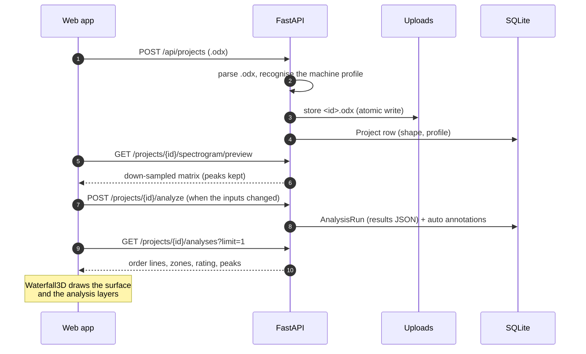
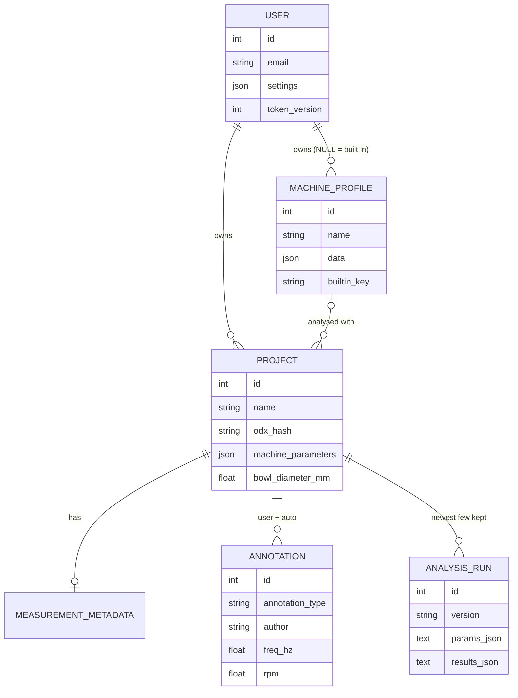
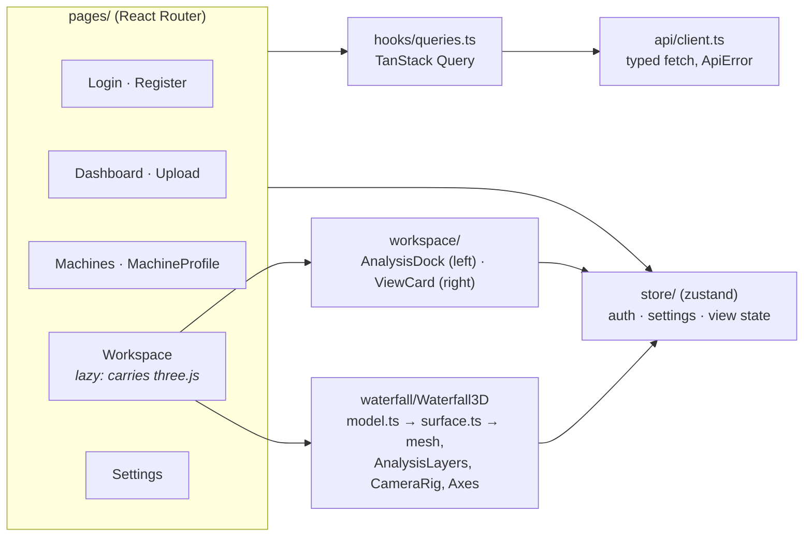

# Architecture

How CentriMinds is put together, below the overview in the
[README](../README.md#architecture).

## How a measurement flows through it

The workspace asks for an analysis whenever the run's input fingerprint
(profile, per-project parameters, pipeline version) differs from the latest
run's, so a profile edit shows up the next time the project opens.

## Data model

The schema belongs to the Alembic migrations in `backend/alembic/versions/`,
applied when the API starts; a test checks that it matches the SQLAlchemy
models.

## In the browser

`WaterfallModel` (`components/waterfall/model.ts`) is the one place that maps
frequency, speed and amplitude to scene coordinates; the surface, the
overlays, picking and the slice view all go through it.
