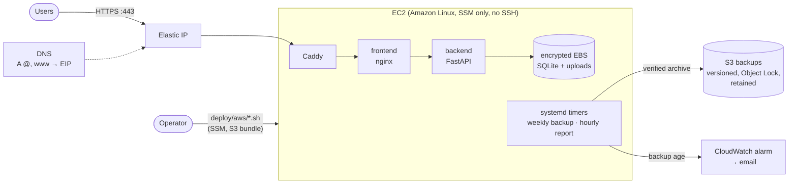

# Self-hosting

CentriMinds runs anywhere Docker runs. This page covers the backend's
settings and the reference deployment on AWS that Protominds operates.

## Configuration

Backend environment variables (`backend/app/config.py`):

| Variable | Default | |
| --- | --- | --- |
| `APP_ENV` | `development` | `production` refuses a weak `JWT_SECRET` and disables the API docs. |
| `JWT_SECRET` | dev placeholder | ≥ 32 random characters in production (`openssl rand -hex 32`). |
| `JWT_ALGORITHM` | `HS256` | `HS256`, `HS384` or `HS512`. |
| `JWT_EXPIRE_DAYS` | `7` | Session length (1–90). |
| `ALLOW_REGISTRATION` | `true` | `false` closes sign-up (the default on AWS). |
| `REGISTRATION_EMAILS` | empty | Comma-separated addresses that may sign up; empty lets anyone. Production needs it whenever sign-up is open. |
| `CORS_ORIGINS` | localhost | Comma-separated. |
| `DATA_DIR` | `./data` | SQLite database and uploads (`/data` in Docker). |
| `MAX_UPLOAD_MB` | `100` | Upload size cap (also enforced by nginx and Caddy). |
| `AUTH_ATTEMPTS_PER_MINUTE` | `10` | Sign-in/sign-up attempts per client IP. |

## On AWS

One EC2 instance runs the Compose stack (`deploy/aws/docker-compose.yml`);
Caddy terminates TLS with Let's Encrypt. The infrastructure is one
CloudFormation stack (`infra/aws/template.yml`).



Prerequisites: AWS CLI v2 with credentials, `python3`, `git` and `curl`.
The scripts read their settings from the environment (all listed at the top
of `deploy/aws/env.sh`):

| Variable | Default | |
| --- | --- | --- |
| `DOMAIN` | `centriminds.de` | Apex domain the app is served on; `www.` redirects to it. **Set your own.** |
| `AWS_PROFILE` | `centriminds` | AWS CLI profile; empty (`AWS_PROFILE=`) uses the CLI's default credentials. |
| `AWS_REGION` | `eu-central-1` | Region of the stack. |
| `STACK` | `centriminds` | Stack name, also the prefix of its bucket names. |
| `ALERT_EMAIL` | keeps current | Address for backup alarms (`provision.sh`). |
| `INSTANCE_TYPE` | `t3.small` | EC2 size (`provision.sh`; a change is a stop/start, data kept). |
| `BACKUP_RETENTION_DAYS` | `90` | How long weekly backups are kept (`provision.sh`). |
| `REFRESH_AMI` | `0` | `1` moves to the newest Amazon Linux, which replaces the instance (`provision.sh`). |
| `REGISTRATION_EMAILS` | keeps current | Who may sign up, or `none` (`deploy.sh`). |
| `SKIP_PREDEPLOY_BACKUP`, `SKIP_BACKUP` | `0` | Skip the safety backup before a deploy, or before a replacement or teardown. |

```bash
export DOMAIN=example.com AWS_PROFILE=myprofile
ALERT_EMAIL=ops@example.com ./deploy/aws/provision.sh   # 1. stack → prints the Elastic IP
# 2. point the A records of @ and www at that IP at your DNS provider
#    (for Hostinger: HOSTINGER_API_TOKEN=… ./deploy/hostinger/set-dns.sh "$DOMAIN" <EIP>)
./deploy/aws/deploy.sh                                   # 3. build + start; re-run to redeploy
```

`provision.sh` applies every change through a CloudFormation change set and
shows it first. Settings you do not pass keep their values. A change that
would replace the instance, and with it the disk holding the data, stops for
confirmation, takes a backup first and prints the commands that bring the
data back. Grow the 30 GB volume in place (`aws ec2 modify-volume`, then
`growpart` and `xfs_growfs`) rather than in the template.

Sign-up is closed after the first deploy. To let people create accounts,
deploy with the addresses that may sign up; each person then registers with
a password of their own. Close it again with `none`. The app refuses to
start in production with sign-up open to anyone.

```bash
REGISTRATION_EMAILS=you@example.com,colleague@example.com ./deploy/aws/deploy.sh
REGISTRATION_EMAILS=none ./deploy/aws/deploy.sh
```

Other hosts work too: any machine with Docker can run
`deploy/aws/docker-compose.yml` (or the root `docker-compose.yml` behind a
TLS proxy of your own; tell nginx about that proxy as `real-ip.conf` does).

### Backups (data only)

The application is rebuilt from Git; only the data is backed up: the SQLite
database and the uploaded `.odx` files.

- **Weekly**: every Sunday 02:30 UTC a systemd timer takes a consistent
  snapshot (SQLite online backup while the app keeps running), verifies
  every checksum in the archive and uploads it to
  `s3://<stack>-backups-<account>/weekly/`. It runs in a one-off container
  on the data volume, so it also works while the app is down.
- **Before every deploy**: the same backup goes to `pre-deploy/` (kept 30
  days), so a bad migration can be rolled back. The deploy stops if the
  backup fails.
- **Storage**: encrypted, versioned, TLS-only, Object Lock (governance, 30
  days), weekly backups kept 90 days. The bucket is retained if the stack is
  deleted, the instance can write backups but never delete them, and access
  is logged.
- **Monitoring**: the instance reports the age of its newest backup every
  hour; an alarm emails `ALERT_EMAIL` if it passes 8 days or the reports stop.

```bash
./deploy/aws/backup-now.sh                                            # back up now
./deploy/aws/restore.sh                                               # list backups
./deploy/aws/restore.sh weekly/centriminds-20261004T023412Z.tar.gz    # restore one
```

A restore takes a safety backup, verifies the archive, stops the app, swaps
the data in and starts the app again; the replaced data stays on the volume
under `/data/.pre-restore-<utc>/`. Locally the same module works on its own:
`python -m app.backup create --out <dir>`, `verify <archive>` and
`restore <archive> --force` (with the app stopped).

`./deploy/aws/teardown.sh` takes a final backup, then deletes the instance.
The backup and access-log buckets are retained on purpose, and
`provision.sh` picks them up again if the stack is created anew.
